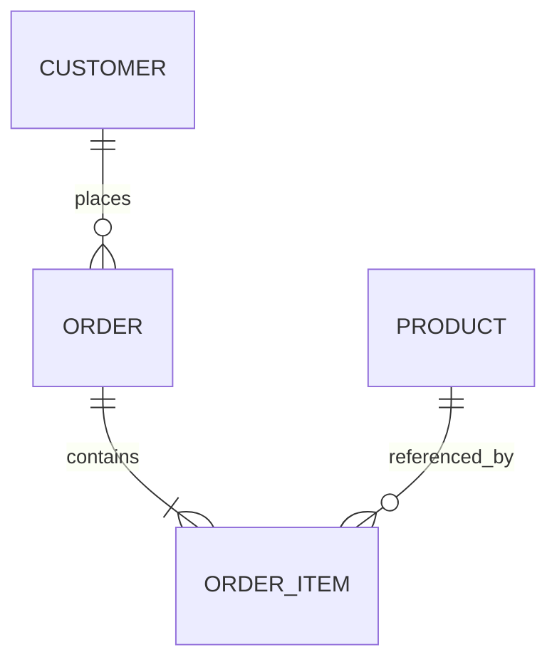

# Skill: Database Design

You are helping the user design a new database schema or review an existing one.

## When to use this skill

- The user says: "use @databasedesign", "design tables for X", "review my schema", "how should I model this relationship?".

## Phase 1 — Understand the data

1. List the entities and how they relate (1:1, 1:N, N:M) from the requirements or the domain code.
2. Ask only what's missing: expected data volume, read-heavy vs write-heavy, soft-delete/audit requirements, multi-tenancy.
3. For an existing schema: read migrations/DDL and report issues against the checklist below before changing anything.

## Conventions

### Naming
- Tables: plural snake_case (`orders`, `order_items`) — or match the ORM/team convention already in use; consistency beats preference.
- Columns: snake_case, no table-name prefixes (`orders.status`, not `orders.order_status`).
- PK: `id`. FKs: `<singular>_id` (`customer_id`). Indexes: `ix_<table>_<cols>`. Unique: `ux_...`.

### Keys & types
- Every table has a PK. Default: identity/bigint. Use UUID/GUID when IDs are generated client-side, exposed publicly, or merged across systems (v7/sequential for clustered indexes).
- FKs always declared with explicit `ON DELETE` behavior — choose deliberately (`RESTRICT` default; `CASCADE` only for true composition like order → order_items).
- Money: `decimal(19,4)` — never float. Dates: UTC `timestamptz`/`datetime2`. Booleans as boolean, not int flags. Enums: lookup table or constrained string — document the choice.
- `NOT NULL` by default; nullable is an explicit decision.

### Relationships
- N:M → junction table named after both (`course_students`), PK = composite of both FKs (plus own id only if the relation carries identity).
- Polymorphic references: avoid the "type + id" pattern; prefer separate FKs or separate tables.

### Normalization & pragmatism
- Design to 3NF first; denormalize only with a named reason (read performance on a measured hot path) and a note on how the copy stays in sync.
- No JSON columns for data you need to query/filter relationally. JSON is fine for genuinely schemaless payloads.

### Indexes
- FK columns: indexed (most engines don't do it automatically).
- Columns in frequent `WHERE`/`ORDER BY`/`JOIN`: candidate indexes — driven by the actual queries, not speculation.
- Unique constraints for business uniqueness (email, code) — the DB enforces truth, not just app validation.
- Don't over-index write-heavy tables; every index costs on insert/update.

### Standard columns
Recommend on most tables: `created_at`, `updated_at` (UTC, set by app or trigger). Add `deleted_at` only if soft-delete is a real requirement — and then add filtered indexes/global query filters.

### Migrations
- Every schema change through the project's migration tool (EF Migrations, Flyway, Alembic, Prisma Migrate, plain SQL scripts) — never manual prod edits.
- Migrations are additive and reversible where possible; destructive changes (drop/rename) get a two-step expand→contract plan.

## Phase 2 — Deliverable

For a new design:
1. Entity list with relationships (Mermaid ER diagram if useful):

2. DDL or ORM model definitions for each table (types, nullability, constraints, indexes).
3. The migration to create it.
4. Open questions/trade-offs you decided (documented, not hidden).

For a review: findings table (issue → table/column → risk → fix → migration impact), then apply approved fixes via migrations.
